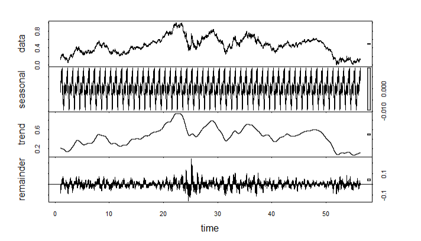
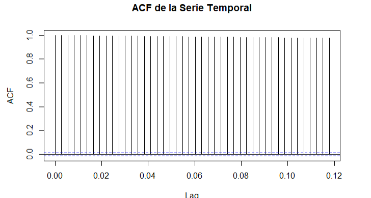

# Modelos Estacionarios en series de tiempo

El Algoritmo prophet permite pronosticar series de tiempo adaptandose a tendencias no lineales, con estacionalidad e involucrando dias festivos o periodos de vacaciones.

Realizaremos la prediccion de nuestros serie basados en el Modelo Prophet.

## 1. Carga y Preprocesamiento del Dataset

Cargamos los paquetes necesarios y el dataset EURUSD_ForexTrading_4hrs.csv que contiene los tipos de cambio Euro Dolar históricos de 2003 a 2021

```{r echo=FALSE, message=FALSE, warning=FALSE, dev = "png"}

# Cargar las bibliotecas necesarias
library(prophet)
library(forecast)
library(tseries)
library(dplyr)
library(readr)
library(ggplot2)
# ===========================
# Paso 0: Inicializar la Tabla Comparativa de MAE
# ===========================

# Inicializar la tabla comparativa
mae_results <- data.frame(
  Modelo = character(),
  MAE_Entrenamiento = numeric(),
  MAE_Validacion = numeric(),
  stringsAsFactors = FALSE
)

# ===========================
# Paso 1: Cargar y Preprocesar el Dataset
# ===========================

# Cargar el dataset desde un archivo CSV
data <- read_csv("EURUSD_ForexTrading_4hrs.csv", show_col_types = FALSE)

# Convertir las fechas y seleccionar las columnas relevantes
data <- data %>%
  mutate(
    ds = as.POSIXct(`Gmt time`, format = "%d.%m.%Y %H:%M:%OS"),  # Convertir a formato fecha-hora
    y = close  # Renombrar la columna 'close' como 'y' para usarla en los modelos
  ) %>%
  select(ds, y)  # Mantener solo las columnas necesarias

# Dividir en conjuntos de entrenamiento (70%) y validación (30%)
set.seed(123)
train_index <- floor(0.7 * nrow(data))
train_data <- data[1:train_index, ]
test_data <- data[(train_index + 1):nrow(data), ]

# Normalizar usando Min-Max basado en el conjunto de entrenamiento
min_y <- min(train_data$y)
max_y <- max(train_data$y)
train_data$y <- (train_data$y - min_y) / (max_y - min_y)
test_data$y <- (test_data$y - min_y) / (max_y - min_y)

# Visualización inicial de los datos
ggplot(data, aes(x = ds, y = y)) +
  geom_line(color = "black") +
  labs(title = "Serie Temporal Original", x = "Fecha", y = "Valor Normalizado") +
  theme_minimal()
```

## 2. Análisis de Estacionalidad

Para analizar la estacionariedad de la serie temporal, se utilizó la descomposición STL, la función de autocorrelación (ACF) y la prueba de Augmented Dickey-Fuller (ADF). Los pasos y los resultados fueron los siguientes:

1.  **Descomposición de la Serie Temporal**:

    

    -   Se descompuso la serie en sus componentes: tendencia, estacionalidad y residuo.

    -   El gráfico resultante muestra que la serie presenta una componente estacional marcada (gráfico en la parte superior).

2.  **Función de Autocorrelación (ACF)**:\
    

    -   El gráfico de la ACF mostró correlaciones significativas en muchos rezagos, indicando que la serie no es estacionaria.

3.  **Prueba ADF (Augmented Dickey-Fuller)**:

    -   El valor p obtenido en el test ADF fue `0.5523948`. Como este valor es mayor a 0.05, no se puede rechazar la hipótesis nula de que la serie tiene una raíz unitaria. Por lo tanto, **la serie no es estacionaria**.

Como se observa, después de la diferenciación la serie se vuelve estacionaria, esto se usará solo en ARIMA que requiere que la serie de tiempo sea estacionaria, para prophet y ets en cambio, la predicción se beneficia de la estacionalidad únicamente, mas no requieren de estacionariedad.

## 3. Ajuste y Predicciones con Prophet

```{r echo=FALSE, message=FALSE, warning=FALSE, dev = "png"}
# ===========================
# Paso 3: Ajuste con Datos del Último Año (Originales) - Prophet
# ===========================

library(prophet)
library(zoo)
library(ggplot2)
library(dplyr)

# Función para detectar puntos de cambio con promedios móviles
detect_changepoints <- function(data, short_window = 5, long_window = 30) {
  # Calcular promedios móviles
  data <- data %>%
    mutate(
      short_ma = rollmean(y, short_window, fill = NA, align = "right"),  # Promedio móvil corto
      long_ma = rollmean(y, long_window, fill = NA, align = "right"),   # Promedio móvil largo
      diff_ma = short_ma - long_ma                                     # Diferencia entre promedios
    )
  
  # Detectar cruces entre promedios móviles
  changepoints <- which(diff(data$diff_ma > 0) != 0)  # Cambios en la señal (cruces)
  
  # Retornar las fechas correspondientes a los puntos de cambio
  return(data$ds[changepoints])
}

# Filtrar el último año del conjunto de entrenamiento
last_year_start <- max(train_data$ds) - as.difftime(365, units = "days")  # Fecha de inicio (365 días atrás)
train_data_last_year <- train_data %>% filter(ds >= last_year_start)

cat("Datos de entrenamiento filtrados al último año:", nrow(train_data_last_year), "registros\n")

# Detectar puntos de cambio con los datos del último año
changepoints_detected <- detect_changepoints(train_data_last_year, short_window = 3, long_window = 14)

cat("Puntos de cambio detectados:", length(changepoints_detected), "\n")

# Ajustar Prophet con los datos del último año (originales)
final_model_prophet <- prophet(
  data.frame(ds = train_data_last_year$ds, y = train_data_last_year$y),
  yearly.seasonality = FALSE,  # Desactivado porque usamos solo un año
  weekly.seasonality = TRUE,   # Mantenemos estacionalidad semanal
  daily.seasonality = TRUE,    # Estacionalidad diaria
  changepoints = changepoints_detected,  # Usar puntos de cambio detectados
  changepoint.prior.scale = 0.5,         # Regularización
  verbose = FALSE
)

# Generar predicciones para el último año
final_train_forecast <- predict(final_model_prophet, data.frame(ds = train_data_last_year$ds))
final_train_predictions <- final_train_forecast$yhat  # Predicciones en escala original

# Calcular el MAE en datos originales
final_train_mae <- mean(abs(train_data_last_year$y - final_train_predictions), na.rm = TRUE)
cat("Prophet MAE (Training - Último Año):", final_train_mae, "\n")

# Agregar Prophet a la tabla comparativa
mae_results <- rbind(
  mae_results,
  data.frame(
    Modelo = "Prophet",
    MAE_Entrenamiento = final_train_mae,
    MAE_Validacion = NA,  # Inicializar con NA para luego asignar el MAE de validación
    stringsAsFactors = FALSE
  )
)

# Combinar valores reales y predichos para visualización
training_results_prophet <- data.frame(
  ds = train_data_last_year$ds,
  Actual = train_data_last_year$y,
  Predicted = final_train_predictions
)

# Visualizar las predicciones para el último año
ggplot(training_results_prophet, aes(x = ds)) +
  geom_line(aes(y = Actual), color = "black", linetype = "solid") +
  geom_line(aes(y = Predicted), color = "blue", linewidth = 1) +
  labs(
    title = "Predicciones en Datos de Entrenamiento (Último Año con Prophet)",
    x = "Fecha", y = "Valores Originales"
  ) +
  theme_minimal()


```

## 4. Ajuste y Predicción en Validación

```{r echo=FALSE, message=FALSE, warning=FALSE, dev = "png"}
# ===========================
# Paso 4: Predicciones Día a Día en Validación (Basado en Índices, Prophet)
# ===========================

# Configuración de parámetros
ticks_per_day <- 6          # Número de ticks por día (4 horas cada tick)
ticks_per_year <- 365 * ticks_per_day  # Número de ticks en un año
num_days_to_predict <- 365   # Días a predecir (configurable)
tolerance <- 0.3            # Tolerancia máxima para el MAE por día

# Variables para almacenar resultados
prediction_results <- data.frame(
  Day = numeric(),
  MAE_Segment = numeric(),
  MAE_Acumulado = numeric()
)
predicted_ticks <- data.frame(
  Tick = integer(),
  Predicted = numeric(),
  Actual = numeric()
)
mae_values <- c()            # Lista para almacenar los MAE de cada segmento
stop_due_to_error <- FALSE   # Flag para detener el loop en caso de error excesivo

# Loop para realizar predicciones día a día
for (day_idx in 1:num_days_to_predict) {
  if (stop_due_to_error) break
  
  # Índices para la ventana de entrenamiento
  start_idx <- (day_idx - 1) * ticks_per_day + 1
  end_idx <- start_idx + ticks_per_year - 1
  
  # Verificar que hay suficientes datos para entrenar
  if (end_idx > nrow(test_data)) {
    cat(sprintf("[DEBUG] Datos insuficientes para el día %d/%d\n", day_idx, num_days_to_predict))
    break
  }
  
  # Datos de entrenamiento
  training_data <- test_data[start_idx:end_idx, ]
  
  # Ajustar modelo Prophet
  daily_model <- tryCatch({
    prophet(
      data.frame(ds = training_data$ds, y = training_data$y),
      yearly.seasonality = FALSE,
      weekly.seasonality = TRUE,
      daily.seasonality = TRUE
    )
  }, error = function(e) {
    cat(sprintf("[ERROR] Fallo al ajustar el modelo para el día %d/%d: %s\n", day_idx, num_days_to_predict, e$message))
    stop_due_to_error <<- TRUE
    return(NULL)
  })
  
  if (is.null(daily_model)) {
    next
  }
  
  # Índices para la predicción
  prediction_start_idx <- end_idx + 1
  prediction_end_idx <- prediction_start_idx + ticks_per_day - 1
  
  # Verificar que hay suficientes datos para la predicción
  if (prediction_end_idx > nrow(test_data)) {
    cat(sprintf("[DEBUG] Datos insuficientes para predecir el día %d\n", day_idx))
    break
  }
  
  # Datos futuros para predicción
  prediction_data <- data.frame(ds = test_data$ds[prediction_start_idx:prediction_end_idx])
  
  # Generar predicciones
  forecast <- tryCatch({
    predict(daily_model, prediction_data)
  }, error = function(e) {
    cat(sprintf("[ERROR] Fallo al predecir para el día %d/%d: %s\n", day_idx, num_days_to_predict, e$message))
    return(data.frame(yhat = rep(NA, ticks_per_day)))
  })
  
  # Valores reales y predichos
  actual_values <- test_data$y[prediction_start_idx:prediction_end_idx]
  predicted_values <- forecast$yhat
  
  # Calcular MAE del segmento
  mae_segment <- mean(abs(actual_values - predicted_values), na.rm = TRUE)
  
  # Guardar predicciones y valores reales en 'predicted_ticks'
  predicted_ticks <- rbind(
    predicted_ticks,
    data.frame(
      Tick = prediction_start_idx:prediction_end_idx,
      Predicted = predicted_values,
      Actual = actual_values
    )
  )
  
  # Guardar MAE del segmento
  mae_values <- c(mae_values, mae_segment)
  mae_acumulado <- mean(mae_values)  # Calcular el MAE acumulado como promedio
  
  # Guardar resultados diarios en 'prediction_results'
  prediction_results <- rbind(
    prediction_results,
    data.frame(
      Day = day_idx,
      MAE_Segment = mae_segment,
      MAE_Acumulado = mae_acumulado
    )
  )
  
  # Mensajes de depuración
  cat(sprintf("\rDía %d/%d - MAE Segmento: %.4f - MAE Acumulado: %.4f",
              day_idx, num_days_to_predict, mae_segment, mae_acumulado))
  
  # Verificar si el error supera la tolerancia
  if (mae_segment > tolerance) {
    cat(sprintf("[ALERTA] Detención temprana por error excesivo en el día %d. MAE: %.4f\n", day_idx, mae_segment))
    stop_due_to_error <- TRUE
    break
  }
}

# Resultados finales
cat("\nResultados finales:\n")
print(prediction_results)

# Filtrar los datos originales y las predicciones para el segundo año de validación
start_validation <- ticks_per_year + 1
end_validation <- ticks_per_year + num_days_to_predict * ticks_per_day
filtered_actuals <- test_data[start_validation:end_validation, ]

# Verificar la alineación de datos
cat(sprintf("[DEBUG] Ranges for actuals: %s - %s\n",
            min(filtered_actuals$ds), max(filtered_actuals$ds)))
cat(sprintf("[DEBUG] Longitud de predicciones: %d \n", nrow(predicted_ticks)))
cat(sprintf("[DEBUG] Longitud de datos reales: %d \n", nrow(filtered_actuals)))

# Verificar que las longitudes coincidan
if (nrow(predicted_ticks) != nrow(filtered_actuals)) {
  stop("[ERROR] La longitud de las predicciones y los datos reales no coincide.")
}

# Crear un nuevo dataset que concatena los datos reales y las predicciones
combined_data <- data.frame(
  Tick = filtered_actuals$ds,
  Actual = filtered_actuals$y,
  Predicted = predicted_ticks$Predicted
)

# Calcular MAE entre los datos graficados
mae_final <- mean(abs(combined_data$Actual - combined_data$Predicted), na.rm = TRUE)
cat(sprintf("[DEBUG] MAE Final Calculado de la Gráfica: %.4f\n", mae_final))
cat(sprintf("[DEBUG] MAE Acumulado Calculado: %.4f\n", mae_acumulado))

# Verificar que el MAE final coincide con el MAE acumulado
if (abs(mae_final - mae_acumulado) > 1e-6) {  # Utilizamos una tolerancia muy pequeña para la comparación
  cat("[ERROR] El MAE calculado a partir de la gráfica no coincide con el MAE acumulado.\n")
  cat("Detalles de las Predicciones:\n")
  print(predicted_ticks)
  cat("Detalles de los Datos Reales:\n")
  print(filtered_actuals)
} else {
  cat("[INFO] El MAE calculado a partir de la gráfica coincide con el MAE acumulado.\n")
}

# Crear el gráfico
ggplot(combined_data, aes(x = Tick)) +
  # Línea negra para los valores reales (segundo año de validación)
  geom_line(aes(y = Actual), color = "black", linetype = "solid", alpha = 0.7) +
  # Línea roja para las predicciones (segundo año de validación)
  geom_line(aes(y = Predicted), color = "red", size = 1, alpha = 0.7) +
  labs(
    title = "Predicciones Día a Día en Validación (Segundo Año, Prophet)",
    x = "Fecha",
    y = "Valores Normalizados"
  ) +
  theme_minimal() +
  theme(axis.text.x = element_text(angle = 45, hjust = 1))

# Actualizar el MAE de validación en la tabla comparativa para Prophet
mae_results[mae_results$Modelo == "Prophet", "MAE_Validacion"] <- mae_final


```

## 5. Ajuste del Modelo ARIMA y Evaluación de MAE en Entrenamiento

```{r echo=FALSE, message=FALSE, warning=FALSE, dev = "png"}

# ===========================
# Paso 5: Ajuste del Modelo ARIMA sobre toda la Serie Original de entrenamiento
# ===========================

library(forecast)
library(ggplot2)

# Ajuste automático del modelo ARIMA
cat("Ajustando modelo ARIMA con auto.arima...\n")
arima_model <- auto.arima(
  train_data$y,
  stepwise = FALSE,     # Exploración más exhaustiva de parámetros
  approximation = FALSE # Ajuste preciso para optimización de parámetros
)

# Resumen del modelo ARIMA ajustado
cat("\nResumen del Modelo ARIMA:\n")
summary(arima_model)

# Predicción sobre el conjunto de entrenamiento
train_forecast_arima <- fitted(arima_model)

# Calcular el MAE en el conjunto de entrenamiento
mae_train_arima <- mean(abs(train_data$y - train_forecast_arima))
cat(sprintf("\nMAE en el conjunto de entrenamiento (ARIMA): %.4f\n", mae_train_arima))

# Actualizar la tabla comparativa con los resultados de ARIMA en el conjunto de entrenamiento
mae_results <- rbind(
  mae_results,
  data.frame(
    Modelo = "ARIMA",
    MAE_Entrenamiento = mae_train_arima,
    MAE_Validacion = NA  # Se actualizará en pasos posteriores
  )
)

# Visualizar las predicciones del modelo ARIMA
ggplot() +
  geom_line(aes(x = 1:length(train_data$y), y = train_data$y), color = "black", linetype = "solid", size = 0.8) +
  geom_line(aes(x = 1:length(train_forecast_arima), y = train_forecast_arima), color = "blue", size = 0.9) +
  labs(
    title = "Predicción de Entrenamiento con ARIMA",
    x = "Ticks",
    y = "Valores Normalizados"
  ) +
  theme_minimal()


```

## 6. Predicción Día a Día en Validación (ARIMA)

```{r echo=FALSE, message=FALSE, warning=FALSE, dev = "png"}
# ===========================
# Paso 6: Predicción Día a Día en Validación (ARIMA)
# ===========================

library(forecast)

# Configuración de parámetros
ticks_per_day <- 6          # Número de ticks por día (4 horas cada tick)
window_size <- 128          # Tamaño de la ventana para ajustar el modelo
num_days <- 365             # Número de días a predecir
tolerance_arima <- 0.3      # Tolerancia máxima para el MAE por día

# Inicialización de variables
validation_predictions <- numeric()  # Para almacenar todas las predicciones de validación
actual_values <- numeric()           # Para almacenar los valores reales de validación
mae_daily <- numeric(num_days)       # Para almacenar el MAE por día
stop_due_to_error <- FALSE           # Flag para detener el loop si el error excede la tolerancia

# Loop para predecir día a día
for (day_idx in 1:num_days) {
  if (stop_due_to_error) break
  
  # Índices para los datos de entrenamiento de la ventana actual
  pred_start <- length(train_data$y) + (day_idx - 1) * ticks_per_day + 1
  pred_end <- pred_start + ticks_per_day - 1
  
  # Índices para la ventana de entrenamiento
  train_start <- pred_start - window_size
  train_end <- pred_start - 1
  
  # Asegurar que los índices de entrenamiento no sean menores que 1
  if (train_start < 1) {
    train_start <- 1
  }
  
  # Seleccionar los últimos 'window_size' ticks para ajustar el modelo
  train_window <- c(train_data$y, test_data$y)[train_start:train_end]
  
  # Ajustar el modelo ARIMA
  model_arima <- tryCatch({
    auto.arima(train_window, stepwise = FALSE, approximation = FALSE)
  }, error = function(e) {
    cat(sprintf("\n[ERROR] Fallo al ajustar el modelo para el día %d/%d: %s\n", 
                day_idx, num_days, e$message))
    return(NULL)
  })
  
  # Verificar si el modelo se ajustó correctamente
  if (is.null(model_arima)) {
    next
  }
  
  # Generar predicciones de los próximos 6 ticks
  forecast_arima <- forecast::forecast(model_arima, h = ticks_per_day)
  predictions <- as.numeric(forecast_arima$mean)
  
  # Obtener los valores reales correspondientes a la predicción
  actual <- c(train_data$y, test_data$y)[pred_start:pred_end]
  
  # Almacenar las predicciones y los valores reales
  validation_predictions <- c(validation_predictions, predictions)
  actual_values <- c(actual_values, actual)
  
  # Calcular el MAE para el día actual
  mae_daily[day_idx] <- mean(abs(predictions - actual))
  
  # Calcular el MAE acumulado hasta el día actual
  mae_acumulado <- mean(mae_daily[1:day_idx])
  
  # Mostrar el progreso con retorno de carro
  cat(sprintf("\rDía %d/%d - MAE del día: %.4f - MAE Acumulado: %.4f", 
              day_idx, num_days, mae_daily[day_idx], mae_acumulado))
  
  # Verificar si el MAE del día excede la tolerancia
  if (mae_daily[day_idx] > tolerance_arima) {
    cat(sprintf("\n[ALERTA] Detención temprana por error excesivo en el día %d. MAE: %.4f\n", 
                day_idx, mae_daily[day_idx]))
    stop_due_to_error <- TRUE
    break
  }
}

# Calcular el MAE total de validación
mae_validation_arima <- mean(mae_daily, na.rm = TRUE)

# Actualizar el MAE de validación en la tabla comparativa
mae_results$MAE_Validacion[mae_results$Modelo == "ARIMA"] <- mae_validation_arima

# Mostrar el MAE de validación
cat(sprintf("\n\nMAE en validación con ARIMA: %.4f\n", mae_validation_arima))

# Graficar las predicciones y los datos reales en validación
ggplot(data = data.frame(Tick = 1:length(actual_values), Actual = actual_values, Predicted = validation_predictions), 
       aes(x = Tick)) +
  geom_line(aes(y = Actual), color = "black", linetype = "dashed", size = 1, alpha = 0.7) +
  geom_line(aes(y = Predicted), color = "blue", size = 1, alpha = 0.7) +
  labs(
    title = "Predicciones Día a Día en Validación con ARIMA",
    x = "Ticks",
    y = "Valores Normalizados"
  ) +
  theme_minimal() +
  theme(axis.text.x = element_text(angle = 45, hjust = 1)) +
  scale_color_manual(values = c("Actual" = "black", "Predicted" = "blue")) +
  guides(color = guide_legend(title = "Leyenda")) +
  theme(legend.position = "top")

```

## 7. Ajuste y Evaluación del Modelo ETS en Entrenamiento

```{r echo=FALSE, message=FALSE, warning=FALSE, dev = "png"}
# ===========================
# Sección 7: Ajuste y Evaluación del Modelo ETS en Entrenamiento
# ===========================

library(forecast)
library(ggplot2)

# Asegurarse de que train_data esté en el formato correcto (serie temporal univariante)
# Suponiendo que la columna que contiene los datos de entrenamiento es 'train_data$y' (ajusta si es necesario)
train_data_ts <- ts(train_data$y, frequency = 24)  # Ajustar la frecuencia según tus datos

# Ajustar el modelo ETS al conjunto de entrenamiento completo
ets_model <- ets(train_data_ts)

# Resumen del modelo ETS ajustado
cat("Resumen del Modelo ETS:\n")
summary(ets_model)

# Predicción en el conjunto de entrenamiento
train_forecast_ets <- fitted(ets_model)

# Calcular el MAE en el conjunto de entrenamiento
mae_train_ets <- mean(abs(train_data$y - train_forecast_ets))  # Comparar con los datos originales de 'train_data$y'
cat("MAE en el conjunto de entrenamiento (ETS):", mae_train_ets, "\n")

# Actualizar la tabla comparativa con los resultados del entrenamiento
mae_results <- rbind(
  mae_results,
  data.frame(
    Modelo = "ETS",
    MAE_Entrenamiento = mae_train_ets,
    MAE_Validacion = NA  # Se actualizará en la siguiente sección
  )
)

# Graficar predicciones vs datos originales para el conjunto de entrenamiento
ggplot() +
  geom_line(aes(x = 1:length(train_data$y), y = train_data$y), color = "black", linetype = "dashed", size = 0.8, alpha = 0.8) +
  geom_line(aes(x = 1:length(train_forecast_ets), y = train_forecast_ets), color = "blue", size = 0.9, alpha = 0.8) +
  labs(
    title = "Predicción de Entrenamiento con ETS",
    x = "Ticks",
    y = "Valores Normalizados",
    color = "Leyenda"
  ) +
  theme_minimal()

```

## 8. Predicciones Día a Día en Validación con ETS

```{r echo=FALSE, message=FALSE, warning=FALSE, dev = "png"}
library(forecast)
library(ggplot2)

# Configuración de parámetros
ticks_per_day <- 6          # Número de ticks por día (4 horas cada tick)
window_size <- 128          # Tamaño de la ventana para ajustar el modelo
num_days <- 365             # Número de días a predecir (1 año)
tolerance_ets <- 0.3        # Tolerancia máxima para el MAE por día

# Inicialización de variables
validation_predictions_ets <- numeric()  # Para almacenar todas las predicciones de validación
actual_values_ets <- numeric()           # Para almacenar los valores reales de validación
mae_daily_ets <- numeric(num_days)       # Para almacenar el MAE por día

# Combinar datos de entrenamiento y prueba
full_data_ets <- c(train_data$y, test_data$y)

# Loop para predecir día a día
for (day_idx in 1:num_days) {
  # Índices para los datos de entrenamiento de la ventana actual
  pred_start <- length(train_data$y) + (day_idx - 1) * ticks_per_day + 1
  pred_end <- pred_start + ticks_per_day - 1
  
  # Índices para la ventana de entrenamiento
  train_start <- pred_start - window_size
  train_end <- pred_start - 1
  
  # Asegurar que los índices de entrenamiento no sean menores que 1
  if (train_start < 1) {
    train_start <- 1
  }
  
  # Seleccionar los últimos 'window_size' ticks para ajustar el modelo
  train_window <- full_data_ets[train_start:train_end]
  
  # Ajustar el modelo ETS
  model_ets <- tryCatch({
    ets(train_window)
  }, error = function(e) {
    cat(sprintf("\n[ERROR] Fallo al ajustar el modelo ETS para el día %d/%d: %s\n", 
                day_idx, num_days, e$message))
    return(NULL)
  })
  
  # Verificar si el modelo se ajustó correctamente
  if (is.null(model_ets)) {
    next
  }
  
  # Generar predicciones de los próximos 6 ticks
  forecast_ets <- forecast::forecast(model_ets, h = ticks_per_day)
  predictions <- as.numeric(forecast_ets$mean)
  
  # Obtener los valores reales correspondientes a la predicción
  actual <- full_data_ets[pred_start:pred_end]
  
  # Almacenar las predicciones y los valores reales
  validation_predictions_ets <- c(validation_predictions_ets, predictions)
  actual_values_ets <- c(actual_values_ets, actual)
  
  # Calcular el MAE para el día actual
  mae_daily_ets[day_idx] <- mean(abs(predictions - actual))
  
  # Calcular el MAE acumulado hasta el día actual
  mae_acumulado_ets <- mean(mae_daily_ets[1:day_idx])
  
  # Mostrar el progreso con retorno de carro
  cat(sprintf("\rDía %d/%d - MAE del día: %.4f - MAE Acumulado: %.4f", 
              day_idx, num_days, mae_daily_ets[day_idx], mae_acumulado_ets))
  
  # Verificar si el MAE del día excede la tolerancia
  if (mae_daily_ets[day_idx] > tolerance_ets) {
    cat(sprintf("\n[ALERTA] Detención temprana por error excesivo en el día %d. MAE: %.4f\n", 
                day_idx, mae_daily_ets[day_idx]))
    break
  }
}

# Calcular el MAE total de validación
mae_validation_ets <- mean(mae_daily_ets, na.rm = TRUE)

# Actualizar el MAE de validación en la tabla comparativa
mae_results$MAE_Validacion[mae_results$Modelo == "ETS"] <- mae_validation_ets

# Mostrar el MAE de validación
cat(sprintf("\n\nMAE en validación con ETS: %.4f\n", mae_validation_ets))

# Graficar las predicciones y los datos reales en validación
ggplot(data = data.frame(Tick = 1:length(actual_values_ets), Actual = actual_values_ets, Predicted = validation_predictions_ets), 
       aes(x = Tick)) +
  geom_line(aes(y = Actual), color = "black", linetype = "dashed", size = 1, alpha = 0.7) +
  geom_line(aes(y = Predicted), color = "blue", size = 1, alpha = 0.7) +
  labs(
    title = "Predicciones Día a Día en Validación con ETS",
    x = "Ticks",
    y = "Valores Normalizados"
  ) +
  theme_minimal() +
  theme(axis.text.x = element_text(angle = 45, hjust = 1)) +
  scale_color_manual(values = c("Actual" = "black", "Predicted" = "blue")) +
  guides(color = guide_legend(title = "Leyenda")) +
  theme(legend.position = "top")


```

## 9. Tabla Comparativa de MAE

```{r echo=FALSE, message=FALSE, warning=FALSE, dev = "png"}
# ===========================
# Sección 9: Tabla Comparativa de MAE
# ===========================

# Cargar las bibliotecas necesarias
library(kableExtra)

# Asegurar que la tabla mae_results esté completa
if (!exists("mae_results")) {
  stop("[ERROR] La tabla mae_results no está definida.")
}

# Generar una tabla ordenada
comparative_table <- mae_results %>%
  arrange(Modelo) %>%  # Ordenar por nombre del modelo
  mutate(
    MAE_Entrenamiento = round(MAE_Entrenamiento, 4),
    MAE_Validacion = round(MAE_Validacion, 4)
  )

# Crear una tabla con formato estético
comparative_table %>%
  kable(
    format = "latex",
    col.names = c("Modelo", "MAE Entrenamiento", "MAE Validación"),
    caption = "Comparación de MAE entre Modelos",
    align = c("l", "c", "c")
  ) %>%
  kable_styling(
    full_width = FALSE,
    bootstrap_options = c("striped", "hover", "condensed", "responsive"),
    font_size = 14
  ) %>%
  row_spec(0, bold = TRUE, color = "white", background = "black") %>%  # Encabezado resaltado
  column_spec(1, bold = TRUE, color = "black") %>%  # Resaltar nombres de modelos
  column_spec(2:3, color = "blue") %>%  # Color para columnas numéricas
  add_header_above(c(" " = 1, "Error Absoluto Medio" = 2))  # Título superior
```

## 10. Discusión

En la evaluación comparativa de los modelos, **ETS** y **ARIMA** demostraron ser las técnicas más robustas, con MAE en validación de **0.0053** y **0.0054**, respectivamente. Estos resultados destacan la capacidad de ambos modelos para generalizar sobre los datos de validación, capturando patrones temporales relevantes. En contraste, **Prophet**, aunque intuitivo y versátil, presentó un desempeño inferior con un MAE de validación de **0.0258**, probablemente debido a su incapacidad para modelar eficientemente los patrones intradía específicos de esta serie temporal.

Una posible explicación para el desempeño superior de ETS radica en su diseño para manejar automáticamente estacionalidades y tendencias, mientras que ARIMA requirió preprocesamiento adicional (diferenciación) para garantizar la estacionariedad de los datos. Por otro lado, el pobre rendimiento de Prophet sugiere que su parametrización predeterminada podría no ser adecuada para series temporales con alta granularidad y comportamiento intradía.

Es importante considerar que el MAE es solo una métrica de error absoluto. Para aplicaciones prácticas, otros factores como la interpretabilidad del modelo, los costos computacionales y la facilidad de implementación deben formar parte del proceso de selección. Adicionalmente, los datos utilizados se limitaron a una frecuencia fija de 4 horas; explorar otras periodicidades o incorporar características externas podría impactar significativamente los resultados.

------------------------------------------------------------------------

## **Sección 11: Conclusiones**

1.  **Mejor Modelo:** El **modelo ETS** fue el más efectivo para este conjunto de datos, logrando el MAE más bajo en validación (**0.0053**), lo que lo convierte en la opción recomendada para aplicaciones prácticas en predicción de series temporales intradía.

2.  **Desempeño de ARIMA:** Aunque ligeramente superado por ETS, ARIMA mostró un rendimiento consistente, con un **MAE en validación de 0.0054**, destacándose como una alternativa confiable para series temporales que requieren análisis más detallados de componentes estocásticos.

3.  **Limitación de Prophet:** Con un MAE en validación de **0.0258**, Prophet no logró capturar adecuadamente los patrones intradía. Ajustes adicionales en sus parámetros o su combinación con otras técnicas podrían ser necesarios para mejorar su rendimiento en escenarios similares.
